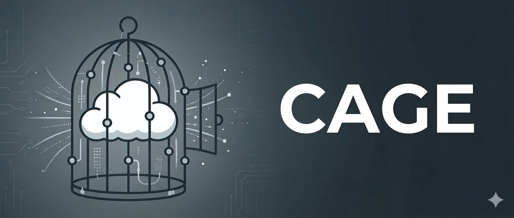

<p align="center">
  
</p>

<h1 align="center">cage</h1>

<p align="center">
  Run coding agents safely in isolated containers — live the <code>--dangerously-skip-permissions</code> life
</p>

<p align="center">
  <a href="https://github.com/pacificsky/cage/actions/workflows/test.yml"></a>
  <a href="https://github.com/pacificsky/cage/actions/workflows/integration.yml"></a>
  <a href="https://opensource.org/licenses/MIT"></a>
</p>

Cage runs coding agents in isolated Docker containers on macOS or Linux. Your project is mounted read-write at the same absolute path — error messages, file references, and tooling all just work.

Requires Docker (Engine or Desktop) or [colima](https://github.com/abiosoft/colima) or [podman](https://podman.io/docs/installation).

## Install

### Homebrew (macOS and Linux)

```bash
brew install pacificsky/tap/cage
```

### Without Homebrew

```bash
curl -fsSL https://raw.githubusercontent.com/pacificsky/cage/main/install.sh | sh
```

Installs to `~/.local/bin`. Run the same command to update. To uninstall:

```bash
curl -fsSL https://raw.githubusercontent.com/pacificsky/cage/main/install.sh | sh -s -- --uninstall
```

## Quick Start

```bash
cd ~/src/my-project
cage start                # create project-specific container and enter it
claude --dangerously-skip-permissions
```

Running `cage start` again from the same directory re-attaches to the existing container.

## Commands

| Command | Description |
|---------|-------------|
| `cage start` | Create or re-attach to container for current directory |
| `cage dstart` | Like `start`, but docker-enabled (see [Docker inside your cage](#docker-inside-your-cage-multi-service-projects)) |
| `cage stop` | Stop the container |
| `cage rm` | Remove the container (volumes preserved) |
| `cage restart` | Remove and recreate container (volumes preserved) |
| `cage update` | Pull latest container image |
| `cage upgrade` | Pull latest image and recreate container |
| `cage status` | Show container name, state, and port mappings |
| `cage list` | List all cage containers across projects |
| `cage shell` | Open an additional shell in a running container |
| `cage rmconfig` | Stop all containers and remove shared home volume |
| `cage obliterate` | Remove all cage containers and shared home volume |

## Examples

```bash
# Start a container with port forwarding
cage start -p 3000:3000

# Multiple ports
cage start -p 3000:3000 -p 5432:5432

# Mount an extra host directory into the container
cage start -v ~/datasets:/datasets

# Open a second shell while an agent is running
cage shell

# Check what's running across all projects
cage list

# Update to the latest container image
cage upgrade

# Start fresh (removes container, keeps volumes)
cage restart
```

## How It Works

### Mounts

| Host | Container | Purpose |
|------|-----------|---------|
| Project directory | Same absolute path | Code editing, matching error paths |
| `cage-home` (Docker volume) | `/home/vscode` | Shared home dir across all cages |
| SSH agent socket | `/run/host-services/ssh-auth.sock` (macOS) or `/tmp/ssh-agent.sock` (Linux) | SSH agent forwarding |

On macOS, cage uses Docker Desktop's / Colima's SSH agent proxy. On Linux, it bind-mounts `$SSH_AUTH_SOCK` directly. `SSH_AUTH_SOCK` is set inside the container to match.

#### Extra mounts

`cage start` and `cage dstart` accept `-v`, with the same syntax as `docker run`:

```bash
# Mount a host directory at the same absolute path
cage start -v ~/datasets:/Users/me/datasets

# Read-only, and mixed with -p — both flags are repeatable
cage start -v ~/models:/models:ro -p 3000:3000
```

Mounting a host path at the *same* absolute path is worth doing where you can. It's why the project directory is mounted that way: paths in error messages, stack traces, and tool output stay valid on both sides.

`-v` only takes effect when a container is created. If one already exists, cage warns and ignores the flag — use `cage rm && cage start -v ...` to apply it. Note that `cage restart` and `cage upgrade` recreate the container *without* your original flags, so mounts you want to keep around belong in a [mount file](#mount-files) instead.

### Injected Environment Variables

These are set automatically on every container:

| Variable | Value | Purpose |
|----------|-------|---------|
| `HOST_UID` | Host user's UID | Lets the container's entrypoint align `vscode` ownership with host files |
| `HOST_GID` | Host user's GID | Same as above, for group ownership |
| `SSH_AUTH_SOCK` | Path to forwarded socket | Points `ssh`/`git` at the host's SSH agent |
| `UV_PROJECT_ENVIRONMENT` | `.cage-venv` | Keeps `uv`-managed venvs out of the host project's `.venv` |

### Shared Home

The `cage-home` volume is shared across all cage containers and projects. Claude credentials, git config, shell history, and tool state all live here — configure once, share everywhere.

### Image Updates

Cage automatically pulls the latest image when creating a new container. When re-attaching to an existing container, it warns if a newer image is available:

```
cage: A newer image is available. Run 'cage upgrade' to upgrade.
```

`cage update` pulls the latest image. `cage upgrade` pulls and recreates the container.

## Configuration

### Environment Variables

| Variable | Default | Description |
|----------|---------|-------------|
| `CAGE_IMAGE` | `ghcr.io/pacificsky/devcontainer-lite:latest` | Container image |

Set `CAGE_IMAGE` to a local image name to skip remote pulls entirely.

### Environment Files

Inject environment variables into containers using env files:

| File | Scope | Description |
|------|-------|-------------|
| `~/.config/cage/env` | Global | Applied to all cage containers |
| `.cage.env` | Per-project | Applied to the current project's container |

Both use Docker's env-file format (`KEY=VALUE`, `#` comments, blank lines). Per-project values override global values.

```bash
# ~/.config/cage/env
ANTHROPIC_API_KEY=sk-ant-...

# ~/src/my-project/.cage.env
DATABASE_URL=postgres://localhost/mydb
```

Env files are read at container creation time. After changes: `cage rm && cage start`.

### Mount Files

Declare extra mounts once instead of passing `-v` on every `cage start` or `cage dstart`:

| File | Scope | Description |
|------|-------|-------------|
| `~/.config/cage/mounts` | Global | Applied to all cage containers |
| `.cage.mounts` | Per-project | Applied to the current project's container |

One `docker -v` spec per line. Blank lines and lines starting with `#` are ignored, a leading `~/` expands to your home directory, and a line with no `:` is mounted at the same absolute path inside the container.

```bash
# ~/.config/cage/mounts
~/datasets
~/.aws:/home/vscode/.aws:ro

# ~/src/my-project/.cage.mounts
/Volumes/scratch:/scratch
```

When two mounts share the same container-side path, the more specific one wins: `-v` on the command line beats `.cage.mounts`, which beats the global file. That makes it possible to point a project at a different source for a path the global file already claims.

Mount files are read at container creation time. After changes: `cage rm && cage start`. Unlike `-v` flags, they are re-read on every creation, so mounts declared this way survive `cage restart` and `cage upgrade`.

### Seed Directory

`~/.config/cage/home/` contents are copied into `/home/vscode/` on new container creation (no-clobber — existing files are never overwritten). Use this to pre-populate dotfiles, shell config, or tool settings.

## Docker inside your cage (multi-service projects)

For full-stack projects where the services themselves run in containers, use
`cage dstart` instead of `cage start`. The agent gets a docker socket and can
run `docker compose up/down/build`, read service logs, and exec into services.

    cage dstart

What the agent's docker socket controls depends on your platform:

- **Linux — trusted mode.** The host daemon's socket is mounted into the cage.
  This is convenient but not contained: a socket is root-equivalent on the
  machine. cage prints a warning banner so nobody is surprised.
- **macOS — contained mode.** cage provisions a dedicated
  [colima](https://github.com/abiosoft/colima) VM (profile `cage`) that mounts
  only `CAGE_SRC_ROOT` (default `~/src`). The agent container and everything it
  spawns live inside that VM. A socket escape is worth at most your project
  checkouts — not your home directory. Requires colima
  (`brew install colima`); Docker Desktop and OrbStack are not supported for
  dstart because their sockets expose your file-shared home directory.

Because cage mounts your project at the same absolute path everywhere (and
colima preserves host paths in the VM), compose files with relative bind
mounts (`./src:/app/src`) work unchanged.

### Worked example

Say `~/src/todo-app` is a typical two-service project:

```yaml
# ~/src/todo-app/docker-compose.yml
services:
  api:
    build: .
    volumes:
      - ./src:/app/src        # relative bind mount — works unchanged in the cage
    ports:
      - "8000:8000"
  db:
    image: postgres:16
    environment:
      POSTGRES_PASSWORD: dev
```

On the host:

```bash
cd ~/src/todo-app
cage dstart        # macOS: first run provisions the cage VM (takes ~1 min)
```

Inside the cage, the agent can drive the whole stack:

```bash
docker compose up -d --build       # build and start api + db
docker compose logs -f api         # watch service logs

# Join the compose network, then reach services by name:
docker network connect todo-app_default "$(hostname)"
curl http://api:8000/health

docker compose exec db psql -U postgres    # exec into a service

# After editing code (the project dir is the same path as on the host):
docker compose up -d --build api
```

From your browser, `http://localhost:8000` works too: on Linux the published
port binds on the host; on macOS colima forwards it to your Mac. Note that
*inside* the cage, published ports are not on `localhost` (the cage is a
sibling container, not the docker host) — use the service name over the
compose network as shown above.

When you're done: `docker compose down` inside the cage stops the stack;
`cage rm` removes only the agent container.

Notes:

- Docker-enablement is a creation-time property. `cage status` shows it
  (`Docker: host|colima|none`). To toggle it: `cage rm`, then
  `cage dstart` (or `cage start`).
- To reach a compose service from inside the cage, join its network:
  `docker network connect <network> $(hostname)`. On macOS, published ports
  are also forwarded to Mac localhost by colima.
- `cage rm` removes the agent container but not the services it started —
  use `docker compose down` first, or on macOS nuke everything with
  `colima delete --profile cage`.
- macOS: the cage VM's daemon has its own `cage-home` volume, so your first
  dstart needs a one-time re-login to Claude (the seed directory applies as
  usual).
- VM sizing: `CAGE_VM_CPU` (default 4), `CAGE_VM_MEMORY` (default 8 GiB), and
  `CAGE_VM_DISK` (default 60 GiB), set in the environment or
  `~/.config/cage/env`. They apply when the VM is first provisioned; to change
  them later, `colima stop --profile cage` and re-run `cage dstart` with the
  new values (disk can only grow). Changing `CAGE_SRC_ROOT` after the VM
  exists requires `colima delete --profile cage`.

## Run from Source

```bash
git clone git@github.com:pacificsky/cage.git
cd cage
ln -s "$(pwd)/cage.sh" /usr/local/bin/cage
```

## License

MIT
